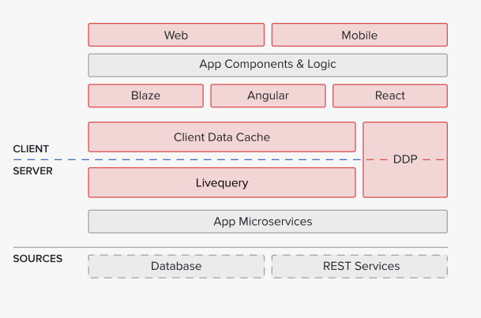

# Meteor Tutorial For HelloWorld

We are going to learn Meteor today. Grab some snacks and then follow these steps to start the tour.

Why do we choose Meteor? Meteor is 

* Quick
* Single language for backend and frontend
* Easy to learn
* Real-time applications at the core
* Tons of smart packages to save your time
* Turn your app into ios and Android easily
* Active and supportive community

Meteor suits the envoirnment of hackathons well. If you have a great idea, don't waste your time setting up server, frontend, and login/signup pages.

> This is a clear chart to show Meteor main architecture.
> 